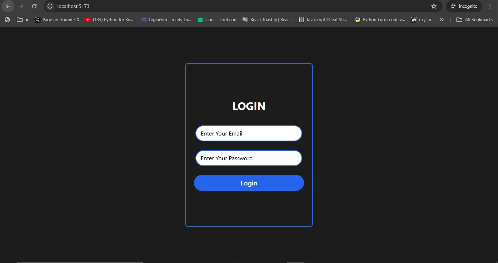
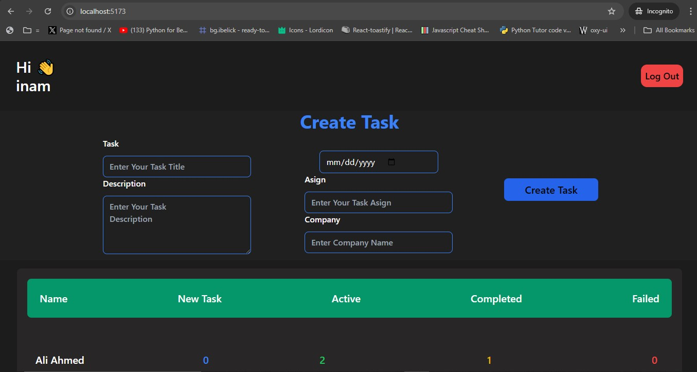
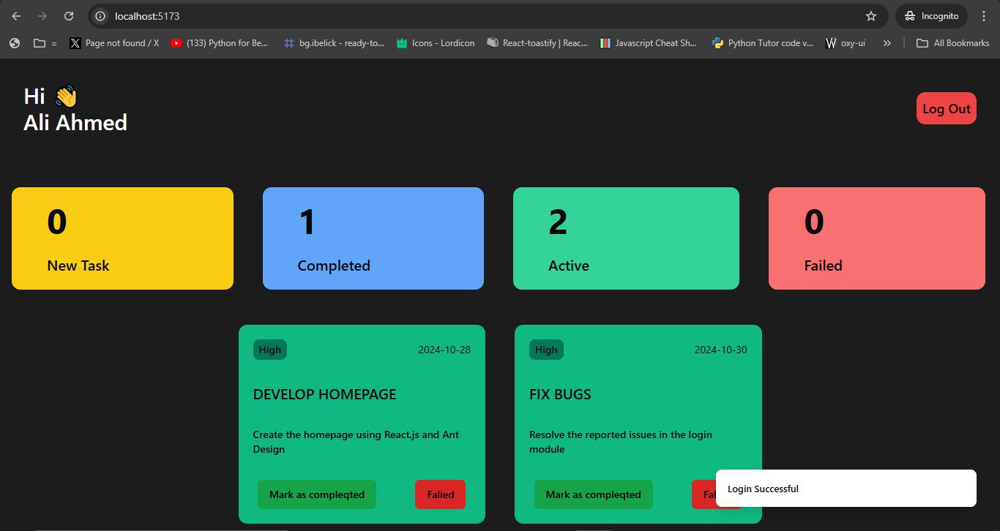

# Task Management System

This project is a simple task management system built with React and styled using Tailwind CSS. It utilizes React's state management capabilities and local storage for data persistence.
 ## Demo Image
 

 ## Features

- Create, read, update, and delete tasks
- Store tasks in local storage for data persistence
- Responsive design using Tailwind CSS

## Technologies Used

- React: A JavaScript library for building user interfaces
- Tailwind CSS: A utility-first CSS framework for rapid UI development

## State Management

This project uses React's built-in state management solutions:

- useState: For component-level state management
- useContext: For sharing state across multiple components (if needed)

## Data Storage

All task data is stored in the browser's local storage, allowing for data persistence between sessions without the need for a backend server.

## Getting Started

1. Clone the repository
2. Install dependencies with `npm install`
3. Run the development server with `npm run dev`

## Additional Resources

- [React Documentation](https://reactjs.org/docs/getting-started.html)
- [Tailwind CSS Documentation](https://tailwindcss.com/docs)
- [Using the Web Storage API](https://developer.mozilla.org/en-US/docs/Web/API/Web_Storage_API/Using_the_Web_Storage_API)
